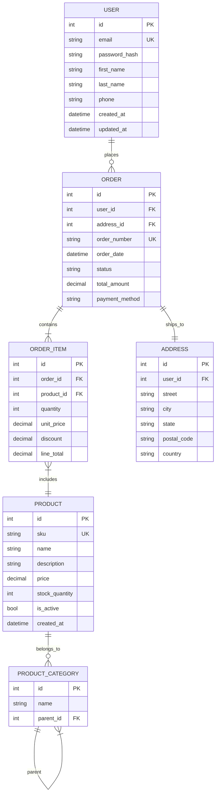

# Data Modeling — ERD

> **Meta:** v1.0.0 | 05-07-2026
> **Parent Skill:** data-modeling

## Purpose

This subskill focuses on creating Entity-Relationship Diagrams (ERD) and understanding entity-relationship concepts. Use it when visualizing data structures, defining entities and attributes, and specifying relationship cardinality.

## When to Use

Use this skill:
- When designing the visual structure of a database
- For defining entities, attributes, and primary/foreign keys
- When specifying relationship cardinality (1:1, 1:N, M:N)
- For generating Mermaid `erDiagram` code
- During data model reviews with stakeholders

## Entities and Attributes

| Component | Description | Example |
|-----------|----------|--------|
| Entity | Real-world object | USER, ORDER, PRODUCT |
| Attribute | Entity characteristic | name, email, price |
| Primary Key (PK) | Unique identifier | id |
| Foreign Key (FK) | Reference to another entity | user_id |
| Unique Key (UK) | Unique value | email |

### Attribute Types

- **Simple** — atomic, indivisible values
- **Composite** — combination of simple attributes (address = city + street + house)
- **Single-valued** — one value for entity
- **Multi-valued** — multiple values (product tags)
- **Derived** — calculated values (age = current_date - birth_date)

## Relationship Types

| Relationship Type | Description | Notation |
|-----------|----------|-------------|
| **One-to-One (1:1)** | One record linked to one record | `||--||` |
| **One-to-Many (1:N)** | One record linked to many | `||--o{` |
| **Many-to-Many (M:N)** | Many records linked to many | `}o--o{` |

### Cardinality

- **Mandatory** — relationship must exist (`||`)
- **Optional** — relationship may not exist (`o`)

## Usage Example

## Naming Conventions

1. Use singular nouns (User, Order, Product)
2. Table names: snake_case (user_roles)
3. Column names: snake_case (created_at)
4. Always name PK as `id`

## Related Skills

- `data-modeling-normalization` — 1NF-3NF and denormalization
- `data-modeling-indexing` — index types and strategy
- `sql-development` — writing SQL queries
